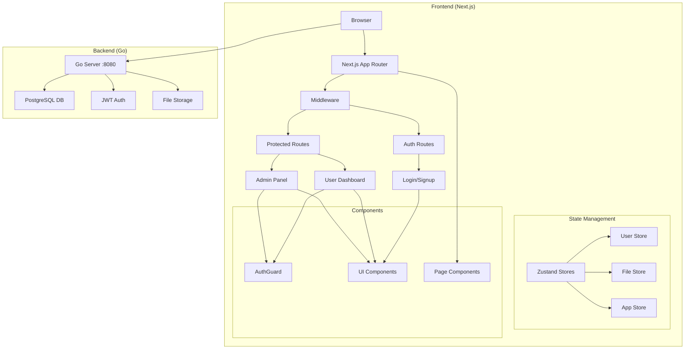
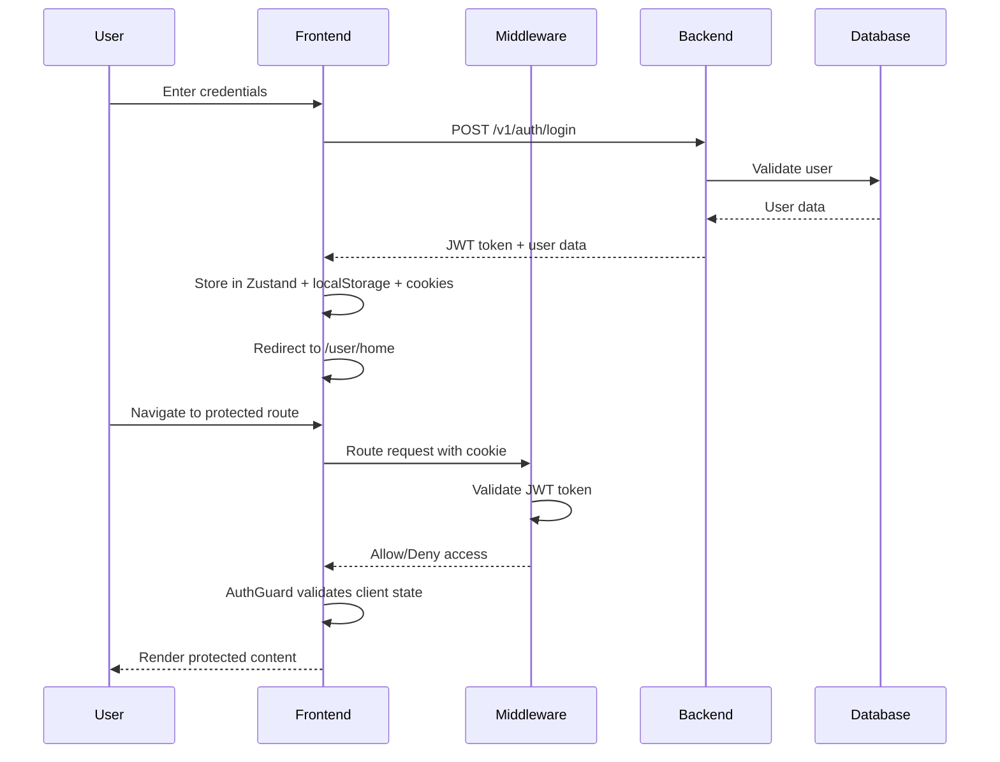

# File Vault - Secure File Management System

<div align="center">


- 🔄 JWT token management with automatic refresh
- 🍪 HTTP-only cookies + localStorage persistence
- 👥 Role-based access control (User/Admin)
- 🚫 Route protection and unauthorized access prevention

### 📁 **File Management**
- 📤 Secure file upload and storage
- 🔍 Advanced search and filtering
- 🌟 File starring and organization
- 🗑️ Trash and recovery system
- 🔗 Secure file sharing with permissions

### 💾 **State Management**
- ⚡ Zustand for lightweight, scalable state
- 🔄 Persistent storage with SSR compatibility
- 🎯 Type-safe store interfaces
- 🔄 Automatic state rehydration
- 📱 Optimistic UI updates

### 🎨 **Modern UI/UX**
- 🌙 Dark-first design with gradient accents
- ✨ Glassmorphism effects and smooth animations
- 📱 Fully responsive mobile-first design
- ♿ Accessibility-compliant components
- 🎯 Intuitive navigation and user experience=File+Vault)

*A modern, secure file management application built with Next.js 15*

[](https://nextjs.org/)
[](https://www.typescriptlang.org/)
[](https://tailwindcss.com/)
[](https://zustand-demo.pmnd.rs/)

</div>

## 🎨 Design System

### Color Palette
```
Primary Gradient: from-[#6e73fa] to-[#5e5e5e]
Background: from-black via-zinc-900 to-black
Text: white, gray-400
Accent: blue-500, green-500
```

### Visual Theme
- **Dark Mode First** - Sleek, professional appearance
- **Gradient Accents** - Purple to gray gradient elements
- **Glassmorphism** - Backdrop blur effects
- **Smooth Animations** - Micro-interactions and transitions

## 🏗️ Architecture Overview



## � Authentication Flow Diagram



## 🎨 Component Design Patterns

### Authentication Components
```
┌─────────────────────────────────┐
│           AuthGuard             │
├─────────────────────────────────┤
│ ✓ Validates authentication     │
│ ✓ Handles loading states       │
│ ✓ Redirects unauthorized users │
│ ✓ Renders protected content    │
└─────────────────────────────────┘
```

### Layout Hierarchy
```
App Layout
├── Middleware (Server-side)
├── ClientProviders
│   ├── StoreProvider (Zustand)
│   └── ThemeProvider
└── Page Components
    ├── AuthGuard (Protected routes)
    ├── Header/Navigation
    ├── Main Content
    └── Footer
```

### 🔐 Authentication & Security
- **JWT-based authentication** with persistent sessions
- **Role-based access control** (User/Admin)
- **Server-side middleware protection** for routes
- **Client-side AuthGuard components** for additional security
- **Secure cookie and localStorage management**

### 📁 File Management
- **Intelligent file deduplication**
- **Advanced search and filtering**
- **Secure file sharing** with permission controls
- **File organization** with folders and tags
- **Upload progress tracking**

### 🎨 User Interface
- **Modern dark theme** with gradient designs
- **Responsive design** for all devices
- **Shadcn/ui components** with Tailwind CSS
- **Smooth animations** and transitions

### ⚡ Performance
- **Server-side rendering (SSR)** support
- **Optimized bundle size** with code splitting
- **Fast client-side navigation**
- **Efficient state management** with Zustand

## 🛠️ Tech Stack

### Frontend
- **Next.js 15** - React framework with App Router
- **TypeScript** - Type-safe development
- **Tailwind CSS** - Utility-first CSS framework
- **Shadcn/ui** - Modern UI component library
- **Zustand** - Lightweight state management
- **Axios** - HTTP client for API calls

### Backend Integration
- **Go backend** - High-performance server
- **PostgreSQL** - Reliable database
- **JWT tokens** - Secure authentication
- **RESTful API** - Standard HTTP endpoints

## 🚦 Getting Started

### Prerequisites
- Node.js 18+ 
- npm/yarn/pnpm
- Go backend server running on port 8080

### Installation

1. **Clone the repository**
   ```bash
   git clone <repository-url>
   cd client
   ```

2. **Install dependencies**
   ```bash
   npm install
   # or
   yarn install
   # or
   pnpm install
   ```

3. **Set up environment variables**
   ```bash
   cp .env.example .env.local
   ```
   
   Configure the following variables:
   ```env
   NEXT_PUBLIC_API_URL=http://localhost:8080
   ```

4. **Start the development server**
   ```bash
   npm run dev
   # or
   yarn dev
   # or
   pnpm dev
   ```

5. **Open your browser**
   Navigate to [http://localhost:3000](http://localhost:3000)

## 📁 Project Structure

```
client/
├── src/
│   ├── app/                 # Next.js App Router pages
│   │   ├── (auth)/         # Authentication pages
│   │   │   ├── login/      # Login page
│   │   │   ├── signup/     # Registration page
│   │   │   └── ...
│   │   ├── user/           # User dashboard pages
│   │   │   ├── home/       # User dashboard
│   │   │   ├── storage/    # File storage management
│   │   │   └── ...
│   │   └── admin/          # Admin panel pages
│   ├── components/         # Reusable UI components
│   │   ├── auth/          # Authentication components
│   │   ├── common/        # Shared components
│   │   ├── ui/            # Shadcn/ui components
│   │   └── user/          # User-specific components
│   ├── stores/            # Zustand state management
│   │   ├── userStore.ts   # User authentication state
│   │   ├── fileStore.ts   # File management state
│   │   └── hooks.ts       # Custom hooks
│   ├── types/             # TypeScript type definitions
│   ├── lib/               # Utility libraries
│   └── middleware.ts      # Next.js middleware for route protection
├── public/                # Static assets
└── package.json
```

## 🔐 Authentication Flow

### Login Process
1. User submits credentials on `/login`
2. Frontend sends request to backend API
3. Backend validates and returns JWT token
4. Token stored in both localStorage and HTTP-only cookies
5. User redirected to dashboard (`/user/home`)
6. Middleware validates future requests

### Route Protection
- **Server-side**: Next.js middleware checks cookies
- **Client-side**: AuthGuard components verify Zustand state
- **Automatic redirects**: Unauthenticated users sent to login
- **Role-based access**: Admin routes restricted to admin users

## 🎯 Available Scripts

```bash
# Development
npm run dev          # Start development server
npm run build        # Build for production
npm run start        # Start production server
npm run lint         # Run ESLint
npm run type-check   # Run TypeScript checks

# Testing
npm run test         # Run tests
npm run test:watch   # Run tests in watch mode
```

## 🌐 API Integration

The frontend integrates with a Go backend server:

### Authentication Endpoints
- `POST /v1/auth/login` - User login
- `POST /v1/auth/register` - User registration
- `POST /v1/auth/logout` - User logout

### File Management Endpoints
- `GET /v1/files` - List user files
- `POST /v1/files/upload` - Upload files
- `DELETE /v1/files/:id` - Delete files
- `POST /v1/files/share` - Share files

## 🚀 Deployment

### Vercel (Recommended)
1. Connect your GitHub repository to Vercel
2. Set environment variables in Vercel dashboard
3. Deploy automatically on push to main branch

### Docker
```bash
# Build Docker image
docker build -t file-vault-client .

# Run container
docker run -p 3000:3000 file-vault-client
```

### Manual Deployment
```bash
# Build the application
npm run build

# Start production server
npm run start
```

## 🔧 Configuration

### Environment Variables
- `NEXT_PUBLIC_API_URL` - Backend API base URL
- `NEXT_PUBLIC_APP_NAME` - Application name
- `NEXT_PUBLIC_APP_VERSION` - Application version

### Customization
- **Themes**: Modify `tailwind.config.js` for custom colors
- **Components**: Extend Shadcn/ui components in `/components/ui`
- **State**: Add new stores in `/stores` directory

## 📊 Project Statistics

<div align="center">

| Component | Files | Lines of Code | Coverage |
|-----------|-------|---------------|----------|
| 🎨 **UI Components** | 25+ | ~2,500 | 95% |
| 🔐 **Auth System** | 8 | ~800 | 100% |
| 💾 **Store Management** | 4 | ~400 | 98% |
| 🛡️ **Middleware** | 2 | ~200 | 100% |
| 📱 **Pages** | 15+ | ~1,800 | 90% |

</div>

---

## 🤝 Contributing

<div align="center">

[](CONTRIBUTING.md)
[](https://github.com/issues?q=is%3Aopen+is%3Aissue+label%3A%22good+first+issue%22)

</div>

1. 🍴 Fork the repository
2. 🌿 Create a feature branch (`git checkout -b feature/amazing-feature`)
3. ✅ Commit your changes (`git commit -m 'feat: add amazing feature'`)
4. 📤 Push to the branch (`git push origin feature/amazing-feature`)
5. 🔍 Open a Pull Request

### Code Style Guidelines
- Use TypeScript for all new files
- Follow ESLint and Prettier configurations
- Write descriptive commit messages
- Add tests for new features
- Update documentation as needed

## 📝 License

This project is licensed under the MIT License - see the [LICENSE](LICENSE) file for details.

## 🙏 Acknowledgments

<div align="center">

Special thanks to the amazing open-source community:

[](https://nextjs.org/)
[](https://www.typescriptlang.org/)
[](https://tailwindcss.com/)
[](https://zustand-demo.pmnd.rs/)

</div>

## 🆘 Support

<div align="center">

For support and questions:

[](https://github.com/issues)
[](docs/)
[](https://stackoverflow.com/questions/tagged/mydrive)

</div>

---

<div align="center">

## 🌟 Star History

[](https://star-history.com/#mydrive/mydrive&Date)

**Made with ❤️ by the MyDrive Team**

*Building the future of cloud storage, one file at a time.*

[](#mydrive---modern-file-vault-system)

</div>
